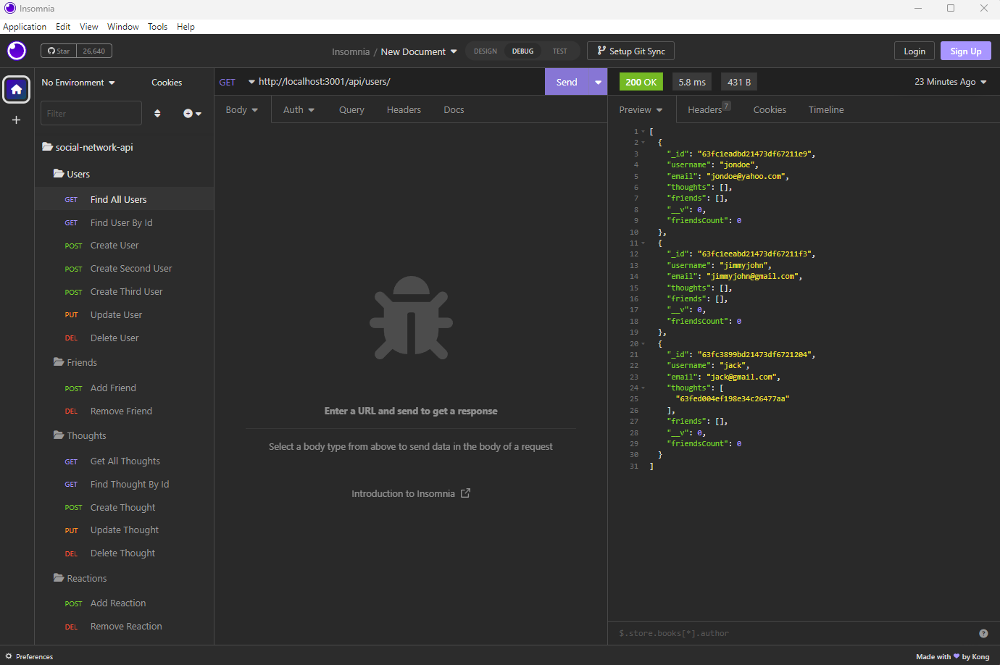

# Social Network Api

## Project Summary

The Goal of this assignment is to build an API for a social network web application where users can share their thoughts, react to friends’ thoughts, and create a friend list. 

There was no starter code given and all the code is written for the back-end. Since there is no front-end code, all testing must be done with Insomnia or another similar application. 

### Here is the link to a video demonstrating the final version of the project.

[Click here to watch a video demonstrating my Social Network Api application.](https://drive.google.com/file/d/1CZ-vkxhgRZCqwcjwW4xuufVL4DmQ1k1p/view)

### This is a screen shot of testing done in Insomnia.

